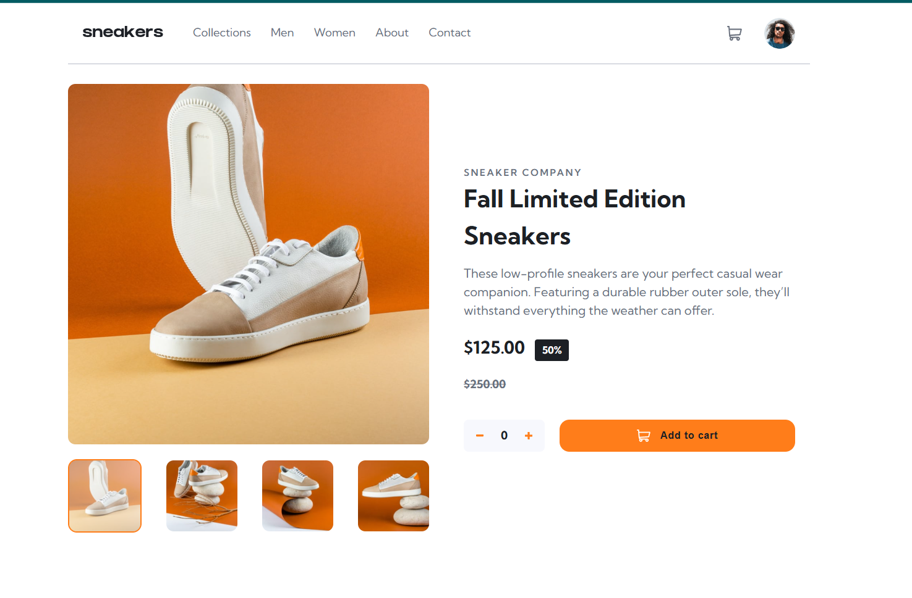

# Frontend Mentor — E-commerce Product Page

## Overview

A fully responsive e-commerce product page built as a [Frontend Mentor](https://www.frontendmentor.io) challenge. The page includes a mobile navigation drawer, an interactive image gallery with thumbnail navigation, a quantity stepper, a cart dropdown, and a desktop lightbox modal — all built with vanilla HTML, CSS, and JavaScript.

## Features

- Mobile-first responsive layout
- Slide-in/out navigation drawer with overlay
- Image gallery with direction-aware slide animation
- Thumbnail navigation with active state
- Add to cart with quantity control and item deletion
- Cart dropdown with live item count badge
- Desktop lightbox modal using the native `<dialog>` element, with arrow and thumbnail navigation synced to the main gallery

## What I Learned

- **CSS Grid and Flexbox** — combining both to build a two-column product layout and flexible component internals
- **Mobile-first CSS** — structuring styles with a single `@media (min-width: 900px)` breakpoint
- **BEM-ish naming** — keeping class names consistent and readable across a growing stylesheet
- **Direction-aware animation** — tracking navigation direction to apply the correct slide animation class, using `void element.offsetWidth` to force a reflow between class removals and additions
- **Native `<dialog>`** — using `showModal()` and `close()` with custom backdrop styling and overflow quirks
- **State synchronization** — keeping a shared `currentIndex` in sync across the main gallery, lightbox image, and two independent sets of thumbnails
- **Accessible markup** — `aria-expanded`, `aria-pressed`, `aria-label`, `aria-modal`, and focus management on open/close

## Built With

- Semantic HTML5
- CSS custom properties
- CSS Grid and Flexbox
- Vanilla JavaScript (no frameworks)

## Acknowledgements

Challenge by [Frontend Mentor](https://www.frontendmentor.io/challenges/ecommerce-product-page-UPsZ9MJp6).
