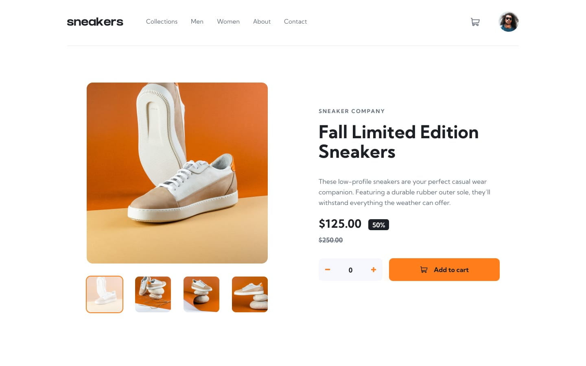
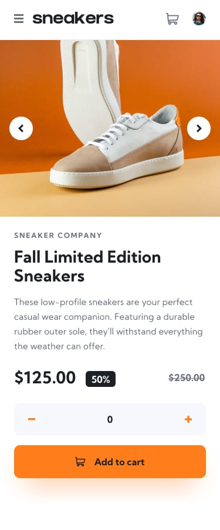

# Frontend Mentor - E-commerce product page

This is a solution to the [E-commerce product page challenge on Frontend Mentor](https://www.frontendmentor.io/challenges/ecommerce-product-page-UPol8lgez).

## Table of contents

- [Overview](#overview)
  - [Screenshot](#screenshot)
  - [Links](#links)
- [My process](#my-process)
  - [Built with](#built-with)
  - [What I learned](#what-i-learned)
  - [Continued development](#continued-development)
- [Author](#author)

---

## Overview

### Screenshot

|  |  |
| :--: | :--: |
| Desktop | Mobile |

### Links

- Solution URL: [Frontend Mentor](https://www.frontendmentor.io/solutions/e-commerce-product-page-PnN4EAZuxg)
- Live Site URL: [GitHub Pages](https://rahulpaul127.github.io/ecommerce-product-page-main/)

---

## My process

### Built with

- Semantic HTML5 markup
- CSS custom properties
- CSS Flexbox
- CSS Grid
- Mobile-first responsive workflow
- Vanilla JavaScript for DOM manipulation

### What I learned

- How to build a **synced image gallery** across three separate states — the main product view, the desktop lightbox, and the mobile slider — all staying in sync using a shared index and a single `setMainImage()` function that updates all three at once.
- Implementing a **desktop-only lightbox** that opens on image click, supports prev/next navigation, thumbnail selection, backdrop click to close, and full keyboard navigation (Arrow keys + Escape) — all without any library.
- Using the **modulo operator (`%`)** for infinite circular navigation through an image array, so going past the last image wraps back to the first and vice versa.
- Managing **multiple UI states** (lightbox open, cart open, sidebar open) simultaneously with boolean flags, and using a single `keydown` listener to handle `Escape` and `ArrowLeft`/`ArrowRight` across all of them.
- **Dynamically rendering the cart** using `createElement` and `innerHTML` instead of hiding/showing static HTML, which keeps the DOM clean and makes it easy to update the item count, price calculation, and delete functionality on the fly.
- Handling the **`hidden` HTML attribute correctly** — applying `[hidden] { display: none !important; }` in CSS to prevent other display rules from overriding it, which fixed the cart badge showing "0" on load.
- Building a **mobile slide-in sidebar** with a dark overlay, CSS `transform: translateX()` transition, focus management, and scroll-lock (`overflow: hidden` on `body`) for a native app-like feel.

### Continued development

- Add the final deployed links after publishing the project.
- Explore adding a **touch swipe gesture** on the mobile image slider for a more natural mobile experience.
- Consider persisting the cart to `localStorage` so items aren't lost on page refresh.
- Add a **quantity limit** to prevent unrealistic cart amounts (e.g., max 10 items).

## Author

- Frontend Mentor - [@rahulpaul127](https://www.frontendmentor.io/profile/rahulpaul127)
- Twitter - [@rahulpaul127](https://x.com/rahulpaul127)
